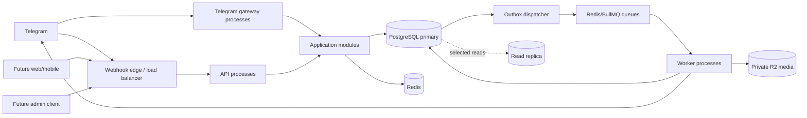

# System Architecture

## 1. Architecture drivers

Nakh starts as a Telegram bot but is a dating platform, not a bot script. Its highest-impact drivers are:

- correct behavior under simultaneous Likes, Nakh actions, purchases, unlocks, deletion, and moderation;
- privacy of profile media, chat content, identity links, reports, and payment records;
- horizontal scaling for bursty Telegram updates, discovery reads, notifications, media processing, and scheduled expiry;
- durable handling of provider callbacks and background work without double charging or double granting;
- a stable application API that future web, mobile, admin, and support clients can use;
- independent evolution of discovery, billing, chat, and media without early distributed-system complexity;
- operational visibility and recoverability from the first production release.

## 2. Quality targets

These are engineering targets, not user-facing promises. Load tests establish the final production numbers.

| Concern | Initial target |
|---|---|
| Availability | 99.9% monthly for command/query API and Telegram update acceptance |
| Telegram webhook | Acknowledge accepted updates within 1 second at p99; long work is asynchronous |
| Application commands | p95 below 300 ms excluding third-party latency and media processing |
| Discovery page | p95 below 500 ms with a warm database/cache at the launch load profile |
| Data durability | PostgreSQL point-in-time recovery; production RPO at most 5 minutes |
| Recovery | Documented and rehearsed RTO at most 60 minutes for a regional service incident |
| Event delivery | At-least-once, idempotent processing; no silent loss |
| Scale baseline | 1 million accounts, 100,000 daily active users, and 1,000 inbound updates/second in bursts |
| Security | No secrets or message/profile text in logs; least-privilege service and operator access |

Capacity is proven rather than assumed. Every release candidate records throughput, p95/p99 latency, error rate, database saturation, queue delay, and cost per active user.

## 3. Chosen architecture

Use a **modular monolith**: one versioned codebase and one transactional PostgreSQL cluster, divided into strict business modules. Run several independently scalable process types from that codebase.

Process types:

- `api`: versioned HTTP API for future clients, internal operations, health, and provider callbacks;
- `telegram-gateway`: validates Telegram webhooks, deduplicates updates, translates Telegram interaction state into application commands, and renders localized responses;
- `worker`: consumes named queues for notifications, media, billing reconciliation, outbox delivery, deletion, and maintenance;
- `scheduler`: elected process that enqueues due work; it never performs business work directly;
- `migration`: one-shot release task that applies verified SQL migrations.

All long-running processes are stateless. They can be replicated and terminated without losing authoritative state. Redis may lose cache/session data without corrupting product state. PostgreSQL and object storage are the durable systems of record.

## 4. Boundary rules

1. Telegram-specific identifiers, keyboards, callback payloads, update objects, and message IDs stop at the Telegram adapter boundary.
2. The application core accepts authenticated actor identity, locale, command data, and an idempotency key. It returns channel-neutral results and presentation intents.
3. Each module owns its tables and repositories. Other modules use its public application contract, not its tables.
4. A use-case coordinator may call multiple module ports inside one database transaction. It may not embed provider calls in that transaction.
5. External side effects are emitted through the transactional outbox and executed after commit.
6. Consumers assume duplicate and delayed delivery. Every handler is idempotent.
7. Redis is for acceleration, leases, rate limits, ephemeral conversations, and queue transport. A Redis outage may degrade service but may not invent or destroy durable product state.
8. JSONB is allowed for immutable provider payloads, localized templates, metadata, and snapshots. It is not a substitute for modeled relationships or controlled values.
9. User-visible behavior is localized by key and typed variables. Business code never contains final English sentences.
10. All timestamps are UTC `timestamptz`; all durable IDs are UUIDv7 generated by the application.

## 5. Synchronous and asynchronous work

Keep synchronously visible decisions in a database transaction:

- consume/validate a guest preview;
- change profile/filter/settings state;
- record Like or Not Interested;
- create, accept, decline, or cancel Nakh;
- establish a Match;
- spend credits and create a scoped entitlement;
- reserve a chat message sequence and store the message;
- initiate account deletion or moderation action.

Perform after commit:

- Telegram sends and edits;
- push/email/SMS notifications if added later;
- image thumbnailing, blur, scanning, and provider deletion;
- reminder/expiry delivery;
- analytics projection and search indexing;
- reconciliation, retry, and operational alerts.

The initiating request receives the committed business result. Delivery state is observable separately and retried safely.

## 6. Data consistency

Strong consistency is required for money/credits, entitlement uniqueness, relationship uniqueness, profile state transitions, maximum pending Nakh count, Nakh acceptance, match creation, chat authorization, guest-preview count, and account deletion state.

Eventual consistency is acceptable for notification delivery, thumbnails, derived discovery projections, dashboards, analytics, and cached counts. User-visible caches must have bounded staleness and must not override a primary-database authorization check.

Use PostgreSQL `READ COMMITTED` by default with row locks, uniqueness constraints, conditional updates, and deterministic lock ordering. Use `SERIALIZABLE` only for a measured workflow that cannot be expressed safely otherwise, and retry serialization failures with a bounded policy.

## 7. Evolution path

Do not begin with microservices. Extract a module only when its boundary is stable and at least one trigger is real:

- it needs independent scaling by an order of magnitude;
- its failure domain must be isolated;
- it requires a different persistence technology;
- release coordination repeatedly blocks teams;
- compliance requires a separate trust zone;
- measured database/queue contention cannot be removed inside the modular monolith.

Extraction order, if needed, is normally media processing, notification delivery, discovery/search projection, and analytics. Identity, billing ledger, entitlements, and relationship state stay strongly consistent until a deliberate distributed transaction design exists.

## 8. Failure behavior

- Database unavailable: reject state-changing commands; do not accept-and-forget them in Redis.
- Redis unavailable: serve safe database-backed reads and critical writes where rate-limit risk permits; pause asynchronous dispatch; fail closed for abuse-sensitive endpoints.
- Telegram unavailable: commit allowed business state, retain delivery work, retry with backoff, and expose delivery failures to operations.
- R2 unavailable: pause uploads/transforms; existing database state remains valid; do not mark media ready before object verification.
- Payment callback duplicated or reordered: provider-event uniqueness and the ledger prevent a duplicate grant.
- Worker crash after side effect: retry uses a deterministic delivery key and reconciliation; provider operations that lack idempotency require a recorded attempt/result state machine.

## 9. Explicit non-goals for the first implementation

- no Kubernetes-only features;
- no Kafka, event sourcing, CQRS data duplication, service mesh, or multi-region active/active writes;
- no GraphQL before a demonstrated client need;
- no direct database access from Telegram handlers, admin scripts, or cron expressions;
- no in-memory timers for product expiry or reminders;
- no synchronous provider calls while holding database locks.
