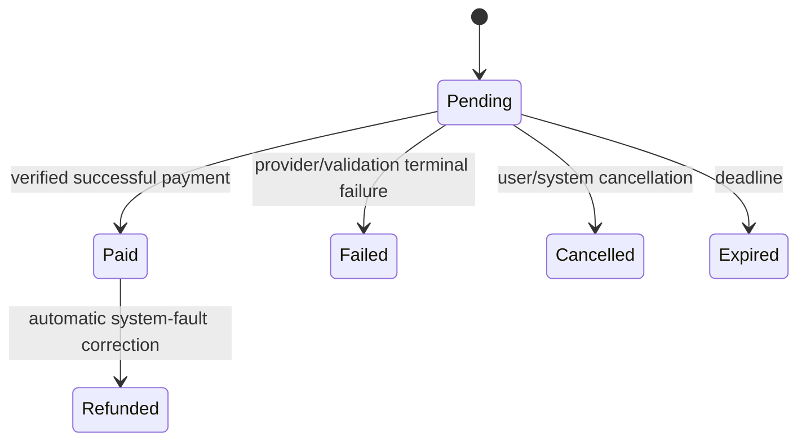

# Payments, Credits, and Entitlements

## 1. Principles

- Telegram Stars is the MVP external payment provider and uses currency code `XTR`.
- Credits are an internal integer product unit, not money, cryptocurrency, or withdrawable balance.
- Payment receipt, credit ledger, and product entitlement/action are separate records linked by immutable references.
- Every external charge produces exactly one of: intended fulfillment, a documented pending reconciliation, or an idempotent automatic correction/refund.
- A successful provider callback is evidence of payment, not by itself evidence that a Nakh/unlock was granted.
- Prices are loaded from versioned configuration/catalog and snapshotted into the funding intent/payment.

## 2. Funding paths

### Package purchase

1. User selects an active CreditPackage.
2. Billing snapshots package code, credits, and full Stars price in a PendingPayment/PaymentRecord.
3. Telegram invoice uses unique opaque payload.
4. Successful Stars payment is recorded once.
5. CreditAccount is locked; one positive purchase ledger entry grants the snapshotted credits.
6. Funding intent becomes paid and payment-success notification is emitted.

### Direct paid action

The payment snapshots the target and action price: two Stars for Nakh, four for Liked By unlock, or four for chat unlock under MVP defaults. On payment success the target action is revalidated and fulfilled. No general credit balance is created from a direct action.

### Credit-funded action

Target state is validated, CreditAccount is locked, negative ledger entry and target grant/delivery occur in the same PostgreSQL transaction. Insufficient balance or closed target creates neither entry.

### Pending Nakh auto-settlement

Every successful CreditAccount increase emits a post-commit settlement job. The worker locks the sender's pending items strictly by `created_at`, then ID, and invokes the coordinator for each. It closes an ineligible oldest item and continues; it stops when the next eligible item cannot be fully funded, so a newer eligible item can never skip an older eligible item. Each delivery locks PendingNakh and CreditAccount, revalidates eligibility, and atomically spends/delivers with its own ledger entry. Duplicate settlement jobs are harmless because pending-state transitions and spend keys are idempotent.

## 3. Invoice and callback validation

Invoice payload is at least 128 bits of cryptographic randomness and maps to exactly one PaymentRecord. Never encode user ID, target ID, or price as trusted cleartext.

Pre-checkout validation checks:

- supported bot/environment/provider;
- payload exists and PaymentRecord is pending;
- Telegram payer maps to PaymentRecord user;
- currency is exactly `XTR`;
- total amount equals snapshotted Stars amount;
- funding intent is pending and not expired;
- action is not already fulfilled or permanently unavailable;
- rate and abuse controls permit the attempt.

Successful-payment processing persists the raw provider event and charge identifier before fulfillment. Unique constraints cover provider event, invoice payload, Telegram charge ID, and any provider payment ID. A duplicate with identical facts returns the existing result; conflicting amount/payer facts are quarantined and paged.

## 4. Fulfillment state machine

Internally, paid fulfillment also has operational progress (`receipt_recorded`, `fulfillment_pending`, `fulfilled`, `correction_required`) represented by fulfillment job/audit metadata, not by inventing public PaymentStatus values. A paid PaymentRecord is immutable evidence even while fulfillment retries.

## 5. Credit ledger

- CreditAccount balance is cached nowhere as authority.
- Every mutation locks CreditAccount and appends one CreditTransaction.
- Ledger before/after values form a continuous chain.
- Idempotency key identifies the business cause, not an HTTP retry attempt.
- Adjustments require an admin permission, reason, two-person approval above a configured threshold when introduced, and payment audit.
- Reconciliation recomputes ordered balance and flags a discontinuity; it never rewrites history silently.
- Negative balance is impossible by database check and conditional update.

Ledger transaction sign:

| Type | Sign |
|---|---:|
| purchase | positive |
| spend_nakh | negative |
| spend_chat_unlock | negative |
| spend_liked_by_unlock | negative |
| refund | positive |
| admin_adjustment | either, with non-negative result |

## 6. Entitlement rules

FeatureUnlock is the sole source for paid viewing/chat permission.

- `liked_by_profile_unlock` scope is one received Like; payer is the Like receiver.
- `chat_unlock` scope is one Match; payer is one Match participant.
- exactly one funding reference proves the grant;
- at most one active unlock per scope;
- MVP unlocks have no time expiry;
- effective access requires both active unlock and actionable scope;
- scope closure does not refund normal use and does not reactivate later;
- system-fault duplicate/invalid grant invokes correction policy;
- admin revocation is audited and uses a reason.

Do not answer access from Telegram message history, a cached button, PaymentRecord alone, or a CreditTransaction alone.

## 7. Corrections and refunds

User-requested refunds are outside MVP. Automatic correction applies when a verified system fault captured value but could not deliver the intended result and no equivalent result was delivered.

- Credit-funded failure: one positive refund ledger entry linked to original spend/cause.
- Stars-funded failure: one RefundRecord drives Telegram's refund operation using the recorded charge ID.
- Refund idempotency key is deterministic from original funding plus correction reason.
- Uncertain refund response is reconciled before another provider call.
- Refund state and provider response are recorded in restricted payment audit.
- A successfully used entitlement, user cancellation after delivery, rejection by another user, expiry under normal rules, unmatch, or moderation due to user conduct is not automatically a system-fault refund.

## 8. Reconciliation and operations

Continuous/periodic monitors detect:

- paid PaymentRecord without fulfillment/correction beyond SLO;
- provider charge identifier attached to more than one payment (database should prevent it);
- PendingPayment paid without exactly one successful PaymentRecord;
- ledger purchase not equal to package snapshot;
- FeatureUnlock with no valid funding proof;
- delivered Nakh with no valid funding proof;
- refund stuck retryable;
- callback amount/currency/payer mismatch;
- payment callback backlog or pre-checkout rejection surge.

Operations can replay fulfillment or reconciliation through audited commands. They cannot mark value delivered by directly editing tables.

## 9. Security and audit

- Encrypt raw provider payload at application layer where retained; store a redacted structured projection for queries.
- Never log invoice payload, charge ID, raw update, bot token, or full payment metadata.
- Payment endpoints have strict per-user and per-IP/channel rate controls.
- Payment and refund worker roles cannot read Profile/chat content.
- All lifecycle transitions, ledger entries, provider callbacks, fulfillments, and corrections carry correlation IDs into PaymentAuditLog.
- Test and production provider records/bot tokens/databases are completely separated.

## 10. Payment test matrix

- same successful update 100 times -> one receipt, one fulfillment, one ledger/grant;
- success arrives after local expiry -> reconcile per captured-value policy, never lose value;
- two concurrent credit spends at exact balance -> only affordable set succeeds, balance never negative;
- payment succeeds while target becomes ineligible -> no invalid grant and automatic correction path;
- worker crashes before/after provider call -> reconciliation reaches one terminal result;
- wrong amount/currency/payer/payload -> no grant, recorded security event;
- duplicate invoice creation request -> stable existing PaymentRecord or a clearly cancelled previous attempt;
- package price changes after invoice -> snapshotted purchase remains valid;
- closed Like/Match -> active cached unlock cannot grant access.
